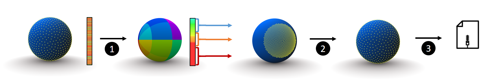

# UniQuant

A header-only library which allows (un)quantifying efficiently unorganized indexed unit vector sets in 3D.


This is the C++ reference implementation of the paper:
>**Fast Lossy Compression of 3D Unit Vector Sets.** *Sylvain Rousseau and Tamy Boubekeur.* SIGGRAPH Asia 2017 Technical Briefs (SA '17). ACM, New York, NY, USA, Article 23, 4 pages. DOI: [https://doi.org/10.1145/3145749.3149436](https://doi.org/10.1145/3145749.3149436)


The demonstrator uses the Spherical Fibonacci point set as quantization method, but can be used with any existing quantization. 
If you want to try other quantizations, it's advisable to use the source code provided as the supplemental material of [this independent unit vector quantization survey](http://jcgt.org/published/0003/02/01/).
If you need a higher precision or speed is the main concern, it's advisable to use octahedral quantization (with the implementation of linked survey additional materials).
This is not the exact same version of the source code that is used to measure performance for the corresponding paper. Performance might have been affected during refactoring.

Copyright(C) 2017 - 2018
Sylvain Rousseau and Tamy Boubekeur
                                                                           
All rights reserved. 

## Building and Running
This program uses CMake. it has been tested on Linux (Ubuntu 16.04, gcc 7.2) and on Windows (Visual Studio 2017)
External libraries are included in the repository, the example is using OpenMP for parallelization. Any compiler that supports C++14 should be able to compile this project without troubles.

### Linux
The source code was tested under Ubuntu 16.04 using gcc 7.2.
To build the example on Linux, go to the directory containing this README.md file, then:

```
mkdir build
cd build
cmake ..
make
```
Then, you can simply run the example

```
./example
```
### Windows
On Visual Studio 2017, open the CMakeLists.txt, and use the Visual Studio 15 2017 generator.

## Project page
The paper and additional resources can be found on the [project page](https://perso.telecom-paristech.fr/boubek/papers/UVC/)

## Citation
Please cite the following paper in case you are using this code:
>**Fast Lossy Compression of 3D Unit Vector Sets.** *Sylvain Rousseau and Tamy Boubekeur.* SIGGRAPH Asia 2017 Technical Briefs (SA '17). ACM, New York, NY, USA, Article 23, 4 pages. DOI: [https://doi.org/10.1145/3145749.3149436](https://doi.org/10.1145/3145749.3149436)


## Authors: 
* [**Sylvain Rousseau**](https://perso.telecom-paristech.fr/srousseau/) 
* [**Tamy Boubekeur**](https://perso.telecom-paristech.fr/boubek)

## Licence
This project is licensed under the MIT license - see the [LICENSE](LICENSE) file for details.
